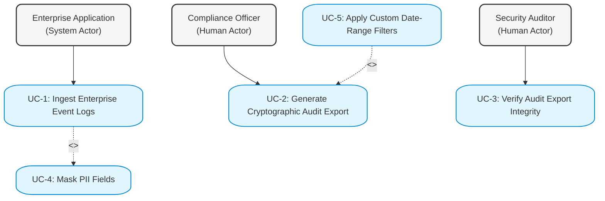

# Compliance Logging Platform - Systems Engineering Deliverables

This document contains the requirements specification, use-case model, and detailed use-case flow specification for the GDPR-compliant immutable logging platform.

## 1. Requirements Specification

| ID | Type | Description | Priority | Acceptance Criteria | Rationale |
| :--- | :--- | :--- | :--- | :--- | :--- |
| **FR-001** | Functional | The platform must ingest event logs from enterprise applications via a secure REST API (HTTPS POST) and syslog endpoints in structured JSON format. | High | 1. Ingestion endpoint validates payload schema. 2. Returns HTTP 202 Accepted for valid payloads, HTTP 400 Bad Request with validation errors for invalid payloads. 3. Handles payload sizes up to 10MB per batch. | Enables secure, standardized data ingestion from heterogeneous enterprise application architectures. |
| **FR-002** | Functional | The system must automatically detect and mask designated PII fields (e.g., email, phone number, SSN, IP address) in the log payload prior to persistent storage. | High | 1. Replaces target PII fields with irreversible keyed cryptographic hashes (SHA-256 with a salt) or tokenized strings. 2. No plain-text PII is written to the persistent database. 3. Masking patterns are configurable via JSON schemas. | Ensures compliance with GDPR "Privacy by Design" (Article 25) and minimizes exposure to data breaches by anonymizing data before it reaches the immutable store. |
| **FR-003** | Functional | The platform must store masked logs in an append-only ledger and register their hashes in a Merkle tree to guarantee cryptographic immutability and tamper-detection. | High | 1. Each log is assigned a sequential, unique sequence number. 2. Updates the Merkle tree root hash dynamically upon block finalization. 3. Detects and alerts on any unauthorized data modification or deletion attempts immediately. | Cryptographic verification ensures that historical logs cannot be modified, deleted, or reordered undetected, establishing audit trust. |
| **FR-004** | Functional | The system must allow authorized Compliance Officers to generate cryptographically signed audit exports for a specified timeframe, containing the logs, Merkle proofs, and a signature manifest. | High | 1. Generates exports as a packaged ZIP containing log data, manifest JSON, and Merkle proofs. 2. Signs the manifest using the platform's private RSA/ECDSA key from KMS. 3. Logs the export generation event in the internal security audit trail. | Compliance Officers must be able to export audit evidence that external regulators can verify independently of the system's operational state. |
| **FR-005** | Functional | The system must provide a verification utility that allows Security Auditors to upload an audit export file and verify its integrity and authenticity. | Medium | 1. Validates the export's digital signature using the platform's public key. 2. Computes log hashes and traverses Merkle paths to verify they match the exported Merkle root. 3. Outputs a clear "Verification Succeeded" or "Verification Failed: [Reason]" report. | Provides Security Auditors with a standard, self-contained mechanism to prove that the logs have not been tampered with since export. |
| **NFR-001** | Non-Functional (Security/Compliance) | The platform must enforce strict GDPR compliance and security by storing all masking and signing keys in a Hardware Security Module (HSM) or cloud Key Management Service (KMS), preventing raw PII leaks in temporary memory or diagnostics logs. | High | 1. Cryptographic keys are stored in a FIPS 140-2 Level 3 compliant KMS. 2. Diagnostic and crash logs contain zero raw PII fields. 3. Enforces RBAC for all cryptographic operations. | Secures the cryptographic assets that underpin the system's immutability and compliance, preventing key compromises that could invalidate all historical proofs. |
| **NFR-002** | Non-Functional (Performance) | The platform must generate and verify cryptographic audit exports efficiently to ensure scalability and usability under heavy operational workloads. | Medium | 1. Export generation for up to 100,000 log entries must complete in under 15 seconds. 2. Export verification for 10,000 log entries must complete in under 5 seconds. 3. Processing throughput must scale linearly with log volume. | Ensures that auditing activities do not cause performance bottlenecks or user interface timeouts during intense compliance reviews. |

---

## 2. UML Use-Case Diagram

The diagram below outlines the interactions between key actors and the Compliance Logging Platform.

### Textual Use-Case Description
- **Actors**:
  - **Enterprise Application** (System Actor): Automatically sends raw transaction/event logs to the system.
  - **Compliance Officer** (Human Actor): Responsible for managing compliance policies and generating audit exports.
  - **Security Auditor** (Human Actor): Responsible for reviewing system logs and verifying the integrity of audit exports.
- **Primary Use Cases**:
  - **UC-1: Ingest Enterprise Event Logs**: The process of receiving logs, validating them, and storing them.
  - **UC-2: Generate Cryptographic Audit Export**: The process of selecting logs, generating cryptographic metadata, signing the package, and exporting it.
  - **UC-3: Verify Audit Export Integrity**: The process of uploading an export package and verifying the signatures and Merkle proof hashes.
- **Supporting Use Cases**:
  - **UC-4: Mask Sensitive PII Fields**: The system function that filters and hashes PII (GDPR compliance).
  - **UC-5: Apply Custom Date-Range Filters**: Optional parameter selection for export generation.
- **Relationships**:
  - **UC-1 includes UC-4** (`<<include>>`): Log ingestion *must* trigger PII masking prior to storage to satisfy GDPR requirements.
  - **UC-5 extends UC-2** (`<<extend>>`): The Compliance Officer can optionally refine the export scope by applying date-range and type filters.

### Mermaid Diagram

---

## 3. Use-Case Flow Specification

### **Use Case ID & Name**: UC-2 - Generate Cryptographic Audit Export

| Section | Detail |
| :--- | :--- |
| **Description** | The Compliance Officer requests a cryptographically signed export of event logs for a specific time range to present to external regulatory bodies. |
| **Actors** | Primary: Compliance Officer (Human) Secondary: Key Management Service (KMS) (System) |
| **Preconditions** | 1. The Compliance Officer is authenticated and authorized via Role-Based Access Control (RBAC). 2. The platform's private signing key is active and accessible via the KMS. 3. The log datastore contains processed, masked log entries for the requested timeframe. |
| **Postconditions** | 1. A cryptographically signed ZIP package containing masked JSON logs, a manifest file, and Merkle tree proofs is generated and downloaded. 2. An entry is recorded in the platform's internal system audit trail detailing the user, time, and query parameters of the export. 3. No raw PII is exposed in the generated export file. |

#### **Main Success Scenario**
1. **Compliance Officer** accesses the admin dashboard, navigates to the "Audit Exports" panel, and enters the desired start and end dates (and optional filters like Application ID).
2. **Compliance Officer** clicks the "Generate Signed Export" button.
3. **System** queries the database and retrieves all masked event logs matching the requested timeframe and filters.
4. **System** calculates the SHA-256 hash of each log entry and constructs a temporary Merkle tree of the result set to generate path proofs.
5. **System** generates a manifest file (containing the log count, start/end dates, hash of individual log files, and the Merkle root hash).
6. **System** calls the **Key Management Service (KMS)** to sign the manifest file using the platform's private signing key.
7. **System** packages the JSON log files, the manifest, the cryptographic signature, and the Merkle path proofs into a standard `.zip` file.
8. **System** presents a secure download link to the **Compliance Officer**.
9. **System** writes a success entry to the internal platform audit log.

#### **Alternate Flows**

##### **Alternate Flow A: No Logs Found in Timeframe**
- *At Step 3 of the Main Success Scenario, the system queries the database and finds zero event logs matching the criteria.*
1. **System** halts the export generation process.
2. **System** displays a warning message to the Compliance Officer: `"No event logs found matching the selected parameters. Please adjust your filters and try again."`
3. **Compliance Officer** adjusts the filters (returns to Step 1) or cancels the request.

##### **Alternate Flow B: Key Management Service (KMS) Unavailability**
- *At Step 6 of the Main Success Scenario, the system fails to establish a secure connection with the KMS or the KMS returns a signature error.*
1. **System** retries the connection twice. If both retries fail, the system halts the generation.
2. **System** writes an error entry with a `High` severity status to the internal system diagnostics logs (excluding any user parameters to prevent leaks).
3. **System** displays an error message to the Compliance Officer: `"Export Failed: The cryptographic service is temporarily unavailable. Please try again later or contact your system administrator."`
4. **System** cleans up any temporary Merkle structures or files generated in memory.
